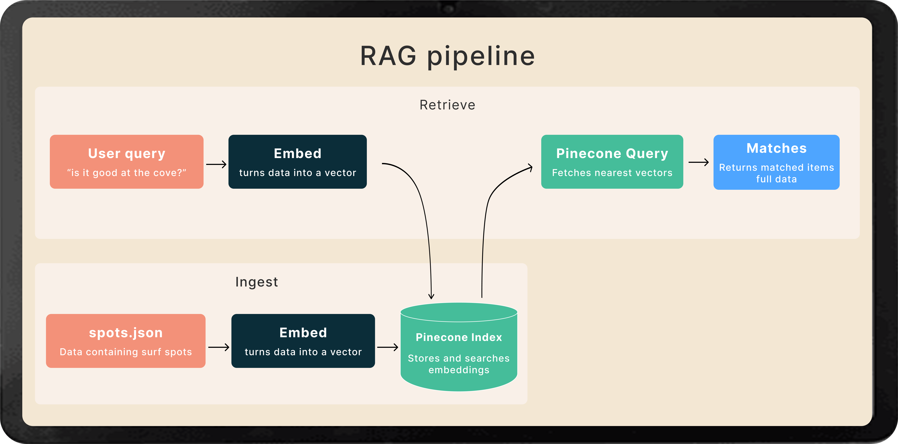

## Surf Agent

### 1) One-liner
An agentic RAG pipeline that retrieves spot knowledge and live ocean conditions, then uses an LLM to recommend whether you should surf and what board to ride.

### 2) How it works
- Orchestrated with LangGraph: retrieve → fetch_conditions → reason.
- RAG: Pinecone stores embeddings of curated spot knowledge; queries are embedded and retrieved, then metadata is hydrated into structured context.
- Tools: NOAA buoy and tide APIs provide real-time swell and tide context.
- LLM reasoning: Anthropic model composes a structured, skimmable recommendation.



Key components:
- `src/agent/graph.py`: LangGraph state machine and edges.
- `src/agent/nodes.py`: retrieval, tools, prompt, and LLM chain.
- `src/rag/ingest.py` / `src/rag/retrieve.py`: Pinecone ingest + retrieval.
- `src/tools/`: `buoy.py`, `tides.py` live data tools.

### 3) Tech stack
- **LLM**: Anthropic Claude (via `langchain-anthropic`)
- **Vector DB + Embeddings**: Pinecone v5 (inference API)
- **Agent Framework**: LangGraph (+ LangChain core)
- **HTTP**: httpx
- **Language**: Python 3.11+

### 4) Running locally
1) Install
```bash
python -m venv .venv && source .venv/bin/activate
pip install -r requirements.txt
```
2) Environment (.env)
```bash
ANTHROPIC_API_KEY=...
ANTHROPIC_MODEL=claude-sonnet-4-20250514
PINECONE_API_KEY=...
PINECONE_HOST=...           # e.g., index-xxxx.svc.us-east1-...pinecone.io
NOAA_TIDE_STATION=9411340   # optional override
NOAA_BUOY_ID=46218          # optional override
```
3) Ingest spot knowledge into Pinecone
```bash
python -c "from src.rag.ingest import ingest_spots; ingest_spots()"
```
4) Run the agent
```bash
python -m src.main
```


